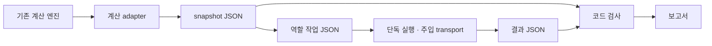

# Independent Codex verification jobs

검증 작업은 에이전트 하나가 저장된 입력만으로 완료할 수 있는 단위다. 사용자·답변·감독 역할은 서로 호출하지 않는다. 질문과 계산 snapshot을 먼저 고정한 뒤 선택한 역할을 단독 실행하거나 코드 실행기로 조합한다. 현재 제품의 자유 질의 기능을 구현한 것은 아니며 답변 초안은 `contract_trial`이다.

## Module ownership and dependencies

| 모듈 | 단독 책임 | 허용 의존성 | 바꾸지 않는 영역 |
| --- | --- | --- | --- |
| `contracts.py` | 엄격한 작업/결과 schema, 해시, 버전 | Pydantic, 표준 라이브러리 | 계산/HTTP/설정/디스크 |
| `cases.py` | 고정 합성 질문·출생 입력 | 계약 | 질문 작성을 위한 모델 호출 |
| `calculation_adapter.py` | 기존 엔진의 계산 결과를 snapshot으로 캡처 | 사주 도메인, 계약 | 생성 provider 호출/재계산 정책 변경 |
| `jobs.py` | 한 역할의 입력 투영, 프롬프트, schema 선택 | 계약 | 실행/다른 에이전트/실시간 카탈로그 |
| `checks.py` | 저장 결과와 원본의 일치·최종 판정 | 계약, 작업 입력 생성 | 모델 호출/판정 기준 자동 수정 |
| `transports.py` | 한 번의 Codex 호출 또는 fixture 반환 | 계약, 작업 프롬프트, subprocess | 내부 재시도/도메인/전역 설정 |
| `runner.py` | 선택적 병행 조합, 예산·취소·수정 한도 | 계약/작업/검사/주입 transport/저장 | 계산 엔진/HTTP/provider 전환 |
| `storage.py` | 명시적 파일 읽기·저장, 보고서 표시 | 계약 | 에이전트/계산 호출 |
| `cli.py` | 명령 조합, 실행 시작 시 설정 캡처 | 위 경계들 | 작업 중 전역 설정 변경 |

하나의 변경 작업은 책임 모듈과 관련 테스트만 소유한다. 공통 계약을 바꿀 때만 먼저 계약/호환성/버전을 검토한다. 프롬프트 수정은 해당 역할 프롬프트, 검사 수정은 `checks.py`, CLI 호출 수정은 `transports.py`에서 처리한다. 계약과 출력 schema를 테스트한 후 조합 실행한다. `AGENTS.md`에서 이 문서와 기존 사주 해석 계약을 함께 읽는다.



독립 job은 계산 모듈이나 서버를 로드하지 않는다. `--help`, `task`, fixture `execute`, `evaluate`는 `app.config`/사주 도메인을 import하지 않는 구조다. 실제 Codex 실행에 필요한 설정은 CLI 시작 시 immutable `CodexConfig`로 캡처한다. 기존 production `call_codex_json`이나 생성기의 자체 repair를 호출하지 않아 숨은 호출이 없다.

## Contract and trust boundaries

- `CaseSnapshot`: 합성 사례, 고정 `as_of`/timezone, 코드 revision/계산 소스 hash, 지식/문구/형식 버전, 원본 payload/plan, 선택 규칙/사실, 보이는 문구, 계산 상태, snapshot hash.
- `AgentTask`: 역할/job ID, snapshot hash, 검토 대상 answer hash, 프롬프트/평가 버전, locale, 해당 역할에 필요한 입력만, task hash.
- `AgentResult`: run/attempt ID, 원 작업, 실제 transport, 실행 상태, 출력 계약 상태, 출력/hash, 시간, 오류 코드, 정리가 확인되지 않은 소유 process IDs. 생성 성공과 출력 계약 성공은 별도다.
- `CaseReport`: 코드 검사와 의미 검토/합성 반응을 분리하고 관측 범위를 `content_only`, 맹검 범위를 `input_blind_only`로 명시한다.

알 수 없는 출력 필드는 거부한다. 해시는 잘못 섞인 입력·답변 회차와 우발적인 변조를 찾는 일관성 검사다. 외부 공격자가 모든 파일/해시를 다시 작성한 경우까지 인증하는 전자서명이 아니다. 계산 snapshot 생성은 기존 엔진이 담당하고 역할 실행은 동결된 원본을 사용한다.

답변은 question/answer/scene/tradeoff/action/analysis_note/limitations/next_question과 제안 claim refs를 갖는다. 계산 사실이나 server provenance·전문가 승인 marker를 모델이 만들게 하지 않는다. 참고 fact IDs가 존재해도 해당 자연어의 의미가 입증되는 것은 아니다.

제품 편집 지식은 [PRODUCT_CONTENT_KNOWLEDGE.md](PRODUCT_CONTENT_KNOWLEDGE.md)와 JSON의 QF-001~003을 따른다. 역할 prompt/rubric는 `.2`로 갱신했으며 이전 `.1` 작업은 새로 생성해야 한다. 미지원 capability 답변은 직접 한계와 필요한 자료 안내만 제공한다. `scene/tradeoff/next_question`과 분석 노트/claim refs는 비워두고 기존 성향 answer/action의 복사를 거부한다. `unsupported_pattern_substitution` 코드 FAIL은 감독의 PASS로 상쇄할 수 없다. 사용자 역할은 한계를 이해한 것과 요청 정보의 충족을 구별한다. 이 검사는 알려진 구조/복사만 검출하며 새로운 자연어 의미·실사용자 흥미를 증명하지 않는다. 역할 작업은 계속 동결 입력만 사용하고 실시간 지식베이스를 읽지 않는다.

사용자 검토에는 persona·질문·visible 결과만 공급한다. 모델 이름, 계산 JSON, 기준 답, 코드 PASS, 감독 의견은 숨긴다. 감독은 고정 사실·질문·답변·코드 검사만 받고 사용자 반응을 보지 않는다. 도구/MCP로 파일을 읽는 접근까지 완전히 제한한 맹검은 아직 구현하지 않았으며 프롬프트 입력만 가린 상태를 정확히 보고한다.

## Commands

모든 출력 경로의 부모 폴더는 이미 존재해야 한다. 증거 파일/실행 폴더를 덮어쓰지 않는다. 상대 경로는 명령을 실행한 위치를 기준으로 한다. 에이전트가 테스트 출력을 만들면 생성 전에 해당 thread artifact ledger에 정확한 출력 root를 등록한다.

```powershell
# 도움말 / 기본 transport 확인
pnpm verify:codex-agents --help

# 전체 조합: S2·S3·S5, fixture 9회, 기본 호출 상한 12
pnpm verify:codex-agents run --transport fixture --output-dir <새-결과-폴더>

# 역할 하나만: 다른 검토는 HOLD
pnpm verify:codex-agents run --cases S3 --roles answer --output-dir <새-결과-폴더>

# 계산 snapshot과 답변 작업은 모델 호출 없이 만든다
pnpm verify:codex-agents prepare --case S3 --output <snapshot.json>
pnpm verify:codex-agents task --snapshot <snapshot.json> --role answer --output <answer-task.json>

# 작업 하나만 실행; 내부 수정/다른 역할 호출 없음
pnpm verify:codex-agents execute --task <answer-task.json> --transport fixture --output-dir <답변-결과-폴더>

# 저장된 답변만으로 감독 작업을 독립 실행
pnpm verify:codex-agents task --snapshot <snapshot.json> --role supervisor --answer <result.json> --output <supervisor-task.json>
pnpm verify:codex-agents execute --task <supervisor-task.json> --transport fixture --output-dir <감독-결과-폴더>

# 저장 결과 병합; 없는 역할은 자동 생성하지 않는다
pnpm verify:codex-agents evaluate --snapshot <snapshot.json> --results <answer-result.json> <supervisor-result.json> --output <report.json>
```

`<...>`는 실제 파일 경로로 바꿀 자리이며 PowerShell에서 그대로 실행하지 않는다. `--cases "S1,S2,S3,S4,S5,S6"`처럼 선택할 수 있다. 기본 transport는 fixture이고 실제 Codex 모델 호출은 `--transport codex`를 명시한 평가 실행에서만 사용한다. Codex 로그인/계정 사용량은 CLI 설정을 따르며 무료/오프라인이라고 설명하지 않는다. 모델을 지정하지 않으면 현재 설정을 유지하고 확인되지 않은 실제 실행 모델 이름을 추정하지 않는다.

`--output-schema`로 출력 형식을 강제하고 `--json` 이벤트 종류를 수집한다. 최종 출력 JSON은 이벤트 stdout과 구분한다. 이벤트 요약에는 단계/attempt/시간/오류를 기록하며 원본 프롬프트·stderr·모델 추론을 복사하지 않는다. 각 native 호출에는 독립 schema/최종 응답 파일이 있다.

## Limits, revisions and failures

기본 `as_of`는 재현용 고정 시각 `2026-10-05T12:00:00+09:00`이다. 다른 기준 날짜를 시험하려면 `prepare`/`run`의 `--as-of`로 UTC offset이 있는 시각을 지정한다. 제품 API의 현재 날짜 처리 기본값은 바꾸지 않았다.

기본 한도는 실제 transport 동시 3, 전체 호출 12, 호출 180초, 사례 600초, run 900초, 수정 0회다. 확장 실행의 `--max-repairs`는 **사례별 최대 2회**이며 전체 호출 상한이 먼저 적용된다. 답변 재작성 후 사용자/감독도 다시 검토하므로 매 호출을 센다. 예산이 부족하면 작업은 skipped/HOLD로 남고 호출을 추가하지 않는다. 첫 실패와 각 수정 회차는 `history.json`에 보존한다.

단독 실행도 call/case/run 시간 제한을 적용한다. Ctrl+C/취소는 대기 작업을 중단하고 실행기 소유의 프로세스 정리를 시도한 뒤 결과/이벤트를 남긴다. 여러 활성 프로세스 중 하나의 정리가 실패해도 나머지를 확인한다. 부모가 먼저 종료된 뒤 정리가 불확실하면 성공으로 간주하지 않고 fatal로 기록한다. 미확인 PID와 상태를 보존하고 새 호출을 중단한다. 실제 native Codex 프로세스의 취소 동작은 아직 모델 호출로 검증하지 않았으며 unit test는 mock으로 검증한다.

한 사례의 계약/hash/처리 오류는 ERROR로 격리하고 다른 사례와 최종 보고서를 유지한다. evidence 저장 위치 자체가 사용할 수 없는 경우 CLI는 실패를 반환하며 보고서를 저장했다고 주장하지 않는다.

| 상태 | 의미 |
| --- | --- |
| ERROR | 실행 또는 산출물 처리 실패. 모델 출력 대신 fallback으로 성공을 꾸미지 않음 |
| FAIL | 관측된 사실/계약/기능 위반. 감독의 긍정 평가로 상쇄 불가 |
| HOLD | 역할 미실행, fixture 의미 미검토, 불확실 판단, 취소/예산 부족 |
| WARN | 관측된 검사 범위의 한계나 합성 사용자의 부정적 흥미 반응 |
| PASS | 해당 코드/정의된 검토 항목 충족. 예측 정확도나 실제 흥미 인증이 아님 |

오늘의 기존 계산 결과는 존재한다. S1에는 기존 summary를 보존하되 새 질문형 근거 계약으로의 migration이 없으므로 `today_contract_mapping=HOLD`다. 이를 입력 부족이라고 설명하지 않는다. 시간 미상의 S5는 대운 규칙/가짜 노트를 생성하지 않는다. S6의 유효 음력 day-30 요청 계약 실패는 FAIL로 유지하고 모델을 호출하지 않는다.

## Verification evidence and remaining work

2026-10-05 구현 검증:

요약 산출물: [검증 결과](CODEX_AGENT_VERIFICATION_RESULT.md), [JSON 증거](CODEX_AGENT_VERIFICATION_RESULT.json).

- 전체 API 회귀 checkpoint: 379 tests passed; 이후 검증 실행기 변경은 해당 신규 회귀를 재실행한다.
- 최종 신규 회귀: 41 tests. 독립 입력/출력, source 값/해시/회차/버전/인용, 기계 FAIL 보존, 예산/동시 호출, 수정 이력, 사례 오류 격리, 취소/프로세스 정리, 시간 제한, import 의존성, Codex CLI schema/오류를 검증한다.
- 실제 계산 snapshot S2/S3/S5 → fixture 9호출 → 모두 HOLD. 감독 작업 별도 생성/단독 실행 → 1회, 출력 계약 passed.
- 6사례 → fixture 15호출 → S1~S5 HOLD, S6 input_validation_422 FAIL. 실제 Codex 생성은 0회.
- 기존 fallback-only HTTP verifier: 456 PASS / 3 WARN / 1 known lunar FAIL. provider guard를 완화하지 않는다.

현재 JSON/Markdown 보고서와 CLI가 구현됐다. 실제 Codex 출력의 의미 검토, 도구 접근까지 제한한 맹검, 실제 사용자 조사, 새 개발용 검증 UI와 자유 질문 기능은 미완료다. 이번 변경은 제품 UI/공유 동작을 바꾸지 않았으므로 새 브라우저 완료를 주장하지 않는다.

같은 날짜의 제품 피드백 보강 회귀: `tests.test_agent_verification`은 신규 3건을 포함해 44건이며 지식/사용자 시나리오/provider guard와 합계 117건 통과했다. 미지원 질문에 성향 내용을 복사한 답변, 부당한 노트/후속 질문, 구버전 작업을 거부한다. 웹 helper 12건과 build/typecheck 통과, fallback HTTP 456 PASS / 3 WARN / 기존 음력 30일 1 FAIL. 새 HTTP 증거는 `.dev-runtime/agent-verification-20261005/product-feedback-guard-review.json`에 유지한다. 이 추가 회귀에서도 실제 Codex 생성·유료 provider 호출은 0회이며 의미/흥미 검토를 통과했다고 보고하지 않는다.

개발 회귀:

```powershell
# apps/api에서, fallback 환경으로
python -B -m unittest tests.test_agent_verification
pnpm test:api
pnpm verify:user-story -SkipBuild -SkipTests
```

실행 출력은 요청 없이 삭제하지 않는다. 향후 수정자는 `docs/PROJECT_STATUS.md`, `docs/ai/WORK_LOG.md`, 계획 037과 이 문서를 같은 작업에서 갱신한다.
