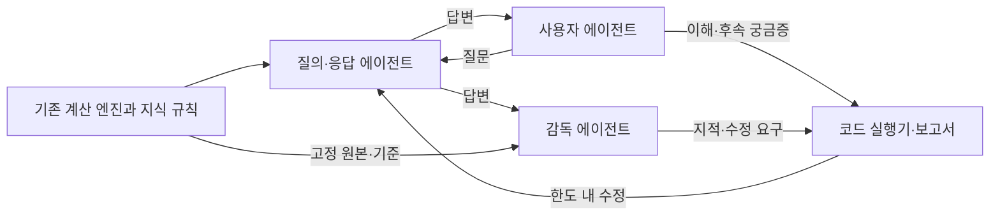

# 037. Codex three-agent verification plan

Status: Independent CLI/job implementation completed. Actual Codex semantic evaluation, full tool-isolated blind review and developer UI remain unverified/deferred. See [the implementation contract](../ai/CODEX_AGENT_VERIFICATION.md).

Implementation evidence (2026-10-05): API checkpoint 379 passed; final new role/runner regressions 41 passed. Actual engine + fixture: 3 cases/9 calls HOLD, 6 cases/15 calls S1–S5 HOLD and known lunar S6 FAIL, standalone supervisor 1 call. Existing guarded HTTP 456 PASS/3 WARN/1 known FAIL. Live Codex generation 0; local development tests do not invoke paid inference.

## Implementation refinement: one job, one responsibility

2026-10-05 추가 요청에 따라 에이전트 간 호출 대신 불변 JSON artifact로 연결한다. 계산 adapter만 도메인 엔진을 import하고, 역할 계약/기계 검사/작업 실행은 계산 엔진이나 HTTP 서버를 import하지 않는다. transport는 주입하며 전역 provider를 바꾸지 않는다.

- `prepare`: 고정 합성 사례의 계산 snapshot을 만든다. LLM 호출 없음.
- `task`: snapshot과 필요한 답변으로 사용자/답변/감독 작업 하나를 만든다. LLM 호출 없음.
- `execute`: 작업 하나를 독립 실행한다. 내부 재시도/다른 역할 호출 없음.
- `evaluate`: 저장된 결과를 합친다. 없는 검토는 HOLD이며 단독 실행을 전체 검증 PASS로 바꾸지 않는다.
- `run`: 위 단위 작업을 선택적으로 조합한다. `--roles answer`로 답변 역할만 실행할 수 있다.

초기 질문은 고정 사례에서 공급하고 사용자 에이전트는 답변 이해/후속 궁금증을 검토한다. 초기 smoke 3사례의 첫 회차는 9회 이하이며 전체 호출 상한 12를 유지한다. fixture 실행은 코드/계약 검증이며 실제 Codex 생성이나 의미 검증 PASS가 아니다. 자유 질문 초안은 contract_trial로 표시한다. 실제 제품 카드와 미래 답변 초안을 구별한다.

## Objective and interpretation

사용자·질의·감독 세 에이전트로 사주 결과의 질문 대응, 이해도, 계산 사실에 대한 충실성, 표현 품질을 검토한다. 이 문서에서 **질의 에이전트는 질문을 받아 답변을 만드는 질의·응답 역할**로 정의한다. 질문의 작성과 후속 궁금증은 사용자 에이전트가 담당한다. 질의 생성 전용 역할을 원한다면 역할 배치를 다시 정의해야 한다.

‘API를 Codex가 대신한다’는 **풀이 생성에 사용하는 OpenAI API 호출을 기존 Codex CLI 경로로 대체**하는 뜻으로 계획한다. 생년월일/출생지 보정·명식·십성·오행·대운·지원 범위 판정은 기존 Python 엔진과 지식 규칙을 유지한다. HTTP 서버 전체나 계산 엔진을 LLM으로 교체하지 않는다. 현재 제품의 입력 계약과 primary 계산 정책도 유지한다.

개발용 별도 실행기를 구현했다. 기존 서버의 provider 설정이나 fallback-only 검증을 전환하지 않는다. 실제 Codex 생성은 명시적으로 선택한 평가 실행에서 호출한다. 기본 fixture 실행은 계산/계약/실행기 연결과 검증 산출물을 확인하며 live 생성으로 표시하지 않는다.

## Confirmed constraints

- `codex_provider.py`에 `call_codex_json`, read-only 설정, 180초 timeout, 최종 JSON 파일 수신이 있다.
- 현재 output schema는 프롬프트에만 넣는다. CLI의 `--output-schema` 강제 옵션은 아직 사용하지 않는다.
- 이 환경의 CLI는 `0.144.1`; `codex exec --help`에서 `--output-schema`, `--json`, `--ephemeral`, `--sandbox`, stdin 입력을 확인했다. version/help 확인은 모델 생성 호출이 아니다.
- `generate_free_preview_report`는 Codex 출력 검증 실패 시 자체 수정 호출을 한다. 외부 감독 수정 루프를 중첩하면 호출 상한을 넘길 수 있다.
- 기존 `verify_user_story.py`와 `X-Saju-Verification-Provider: fallback` 가드는 fallback만 허용한다. 이 경로를 Codex로 우회하거나 완화하지 않는다.
- 현재 UI/API는 자유 질의·후속 채팅을 제공하지 않는다. 자연어 질문은 초기 검증기에서 평가 의도 메타데이터다. 실제 public 요청에는 기존 출생 입력만 넣고 대상 카드는 결과에서 선택한다.
- 서버 fallback의 exact-text 판정과 Codex의 의미 검토는 서로 다른 검사다. Codex가 `reading_structure`, 전문가 승인, 서버 provenance를 만들어 제출할 수 없다.
- 기존 유효 음력 1990-02-30의 422 실패는 새 평가에도 보존한다. 결과가 없는 경우 콘텐츠/공유 검토는 `not_observed`다.

## Roles and authority

| 역할 | 입력 | 출력 | 권한 경계 |
| --- | --- | --- | --- |
| 사용자 | 고정 합성 페르소나·목표, 사용자에게 보인 결과/제한/노트 | 초기 질문, 이해한 한 문장, 행동 하나, 막힌 문구, 후속 궁금증, 가상 공유 선택 | 계산 판정·기대 답·모델 이름·기계검사 PASS를 보지 않는다. 실제 사용자 만족도나 공유율을 산출하지 않는다. |
| 질의·응답 | 사용자 질문/상황, 고정 InterpretationPayload/ReadingPlan, 지원 범위, 문장 형식 | 답변 초안 또는 실제 생성 결과, 제안 claim refs, 제한/미지원 안내 | 재계산·규칙 활성화·테스트/코드 수정·자체 승인 불가. 사용자 진술을 계산 사실로 바꾸지 않는다. |
| 감독 | 같은 고정 사실/규칙/지원 범위, 원 질문, 답변과 코드 검사 결과 | 사실/의미/질문 대응/말투 지적, 근거 인용, 제한된 수정 요청 | 코드의 사실 FAIL을 PASS로 바꾸거나 평가 기준을 결과에 맞춰 수정하지 않는다. 실제 사주 예측 정확도를 인증하지 않는다. |

별도의 **코드 실행기**가 큐·호출·검사·기록·최종 상태를 관리한다. 네 번째 LLM 에이전트를 추가하는 구조가 아니다. 각 에이전트는 독립 문맥이며 작성자의 세션을 감독/사용자에게 이어주지 않는다. 같은 모델을 쓰는 판단은 오류가 상관될 수 있으므로 3개 역할의 동의가 전문가 검증을 뜻하지 않는다.

## Dependency-aware parallel execution

세 worker는 동시에 준비한다. 사용자 worker는 사례/질문을 준비하고, 질의 worker는 고정된 사실을 받아 작업하며, 감독 worker는 기대 조건과 기계 검사를 준비한다. 답변 이후 사용자 반응과 감독의 의미 검토를 독립적으로 병행하고 두 판단이 제출된 뒤 병합한다. 감독은 자신의 첫 판정을 내리기 전에 사용자 반응을 읽지 않는다.

같은 사례의 질문→답변은 순서가 필요하다. 다른 사례의 준비/응답/검토는 서로 병행할 수 있다. 실제 Codex subprocess 전체에 공유 semaphore를 적용한다. 브라우저 조작은 단일 실행기만 담당하여 탭·입력 충돌을 막는다.

## Data contracts

계약은 Pydantic/JSON Schema로 고정하고 알 수 없는 필드는 거부한다. 모델이 IDs/hash를 제안해도 실행기는 원 작업의 값과 비교한다.

| 계약 | 필수 내용 |
| --- | --- |
| RunSpec | run_id, case_ids, source_revision/working_tree_hash, 계산·지식·문구·프롬프트·평가 기준 버전, 고정 as_of/timezone, 모델 설정/확인된 실행 모델, 동시 실행/호출/시간/수정 상한 |
| CaseSnapshot | case_id, 합성 birth_input, persona, question_id/목표, ui_topic, InterpretationPayload, ReadingPlan, 지원 범위/제외 조건, fact_hash, input_hash |
| UserReview | blind_candidate_id, evaluation_kind=synthetic_persona_review, observation_scope, 한 문장 이해/행동/예시 인식/기대한 내용, 실제 인용, 후속 질문, simulated_next_step/share_intent |
| AnswerDraft | question_id, response_mode=supported/scope_limited/needs_input, question/answer/scene/tradeoff/action, analysis_note, limitations, next_question, claim_refs |
| SupervisorReview | 각 항목의 pass/fail/uncertain, 원문 위치/실제 인용, fact/rule 경로, 판단 이유, 수정 요청. overall 승인 권한은 코드 실행기에 둔다. |
| Event/Report | run_id/case_id/turn_id/attempt_id, role, revision/hash, stage, timestamp, duration, 실제 provider, 생성/검사/사용자/감독 상태, 원본 결함과 수정 이력 |

`attempt_id`는 개별 Codex 호출마다 새로 만들고 수정 회차는 별도 필드로 둔다. 기존 시간 기반 provider response_id는 보조 정보다. 실행기가 결과를 합칠 때 IDs·hash·revision 불일치면 stale 결과로 거부한다. 출력 인용이 실제 텍스트에 존재하는지도 코드로 검사한다.

claim_refs는 `text_ref → fact_ids/rule_ids` 형태의 **모델 제안**이다. 참조 존재와 실제 조건은 기계로 검사하고, 그 문장이 해당 근거로 뒷받침되는지는 감독이 별도 검토한다. 참조가 있다는 이유로 의미를 검증했다고 표시하지 않는다. Codex 표현을 기존 fallback의 문구와 글자 단위로 비교하지 않는다.

기존 앱에 없는 자연어 질의 답변을 AnswerDraft로 시험할 때는 `execution_mode=contract_trial`로 기록한다. 이는 미래 질문 기능의 후보이며 현재 제품에서 해당 대화가 실행됐다는 증거가 아니다. 실제 public 카드의 평가와 후보 초안 평가는 보고서를 분리한다.

## Supervision and outcomes

| 계층 | 검사 |
| --- | --- |
| 코드 검사 | JSON/필드/역할, source·fact/rule 존재·실제 값·적용/제외 조건, 날짜·불확실성 보존, 금지 숫자/알려진 보장 표현, provider/timeout/대체 여부, 결과 revision, 인용 실재 |
| 감독 의미 검토 | 질문에 직접 답했는지, 책임 증가를 보상 개선으로 바꾸지 않았는지, 예시를 과거 경험/상대 속마음으로 단정하지 않았는지, 미지원 범위를 정확히 설명하는지, 노트-본문 모순, 친근함/시비/공포/반복 |
| 합성 사용자 검토 | 한 문장으로 이해할 수 있는지, 행동이 구체적인지, 제한을 알아챘는지, 공유할 문구와 맥락, 혼란과 후속 궁금증 |
| 실제 화면 검증 | 별도 단일 브라우저 작업으로 320/390px 표시·가로 넘침·실제 입력/결과/공유 생성 확인. 화면이 없으면 모바일 가독성·클릭 성공은 not_observed |

판정별 수치 평균으로 합격시키지 않는다. 사실 위반은 표현 점수로 상쇄하지 못한다. 부정적인 사용자 반응과 에이전트 간 불일치도 그대로 보존한다.

- `ERROR`: CLI/인증/출력/timeout 등 실행 실패.
- `FAIL`: 관측된 사실 위반, 미지원 예측 주장, 실제 기능 결함.
- `HOLD`: 근거 부족, 의미 판단 불확실, 미관측 화면, 예산 소진, 검토 필요.
- `PASS`: 정의된 범위의 검사 충족. 예측 정확도나 실제 사용자 흥미 인증이 아니다.
- `WARN`: 완료 결과에 남는 범위 제한. 필수 항목의 미관측을 대신 PASS 처리하지 않는다.

계산 성공·Codex 생성 성공·내용 검사·결과 전달을 각각 기록한다. fallback이 전달돼 HTTP200이어도 `codex_generation=failed/degraded`로 남긴다. 수정 성공은 최초 성공과 구분한다. 감독이 생성 실패나 미관측을 일반적인 부정 평가로 숨기지 않는다.

시기/확률/인구 순위 질문은 현재 capability의 미지원 상태를 보존한다. contract_trial 초안은 산출 불가를 직접 설명하고 지원되는 관계/업무 방식 및 행동을 제시한다. 추가 사용자 정보를 받았다는 이유로 미검토 시기 규칙을 활성화하지 않는다.

## Codex transport and execution limits

기존 provider를 기반으로 검증용 **단일 시도 adapter**를 만든다. 전역 settings를 작업 중 변경하지 않고 호출별 config snapshot을 주입한다. 역할별 프롬프트·스키마, stdin 입력, `--output-schema`, `--json`, 최종 응답 파일을 사용한다. `--json` 이벤트 로그와 최종 JSON 결과는 구별한다. read-only로 실행하며 모델을 지정하지 않으면 현재 설정/CLI 기본값을 사용하고 실제 모델이 확인되지 않으면 이름을 추정하지 않는다.

사용자 검토에는 provider, 생성 모델, 버전 이름, 개발자의 기대 답, 다른 에이전트 판정, 내부 fact JSON을 전달하지 않는다. A/B 후보는 이름/순서를 무작위화한다. 역할 프로필의 tool/MCP 접근도 통제하여 입력만 가려놓고 카탈로그를 읽는 누출을 막아야 한다. 입력 제한만 구현됐으면 `input_blind_only`로 보고하고 완전한 맹검이라 부르지 않는다. 현재 CLI에서 필요한 접근 제한의 지원 여부는 구현 전 확인 항목이다.

초기 smoke 실행은 **3개 합성 사례 × 1질문**, 수정 없이 최대 **12 Codex 호출**, 동시 **3개**, 개별 호출 **180초**, case **600초**, run **900초**를 제안한다. 질문 작성/답변/사용자 반응/감독 각각의 호출을 모두 센다. 이후 확장 모드에서 답변 수정 최대 **2회**를 허용하며 run/case 호출 상한은 실행 전에 별도로 고정한다. 후속 질문도 최대 2turn으로 제한하고 모든 내부 수정 호출을 예산에 포함한다.

timeout·취소 시 실행기 소유의 해당 프로세스 트리만 종료·정리하고 완료를 확인한다. 정리 실패 시 추가 작업을 멈춘다. 같은 파일에 worker가 병렬로 쓰지 않으며 이벤트·상태·보고서는 실행기 한 곳에서 기록한다. 임시 출력 경로는 생성 전에 thread artifact ledger에 등록하고 사용자 검토 산출물은 요청 없이 삭제하지 않는다. 인증정보/실제 사용자 생년정보/원본 프롬프트를 일반 요약 로그에 저장하지 않는다.

Codex CLI는 로컬에서 실행하는 도구다. 저장된 로그인 방식과 모델 호출 경로에 따라 계정 사용량/과금이 달라질 수 있으며 무료 또는 오프라인 생성으로 소개하지 않는다. 초기 사례는 합성 입력만 사용한다.

## Scenario set

첫 smoke는 S2·S3·S5를 권장한다. 이후 6개 고정 사례와 미지원 질문/날짜 경계/표기 변조를 확장한다. 예시는 실제 인물의 정보가 아니다. 질문/후속 문장은 평가 의도이며 public API 요청 필드를 새로 만든다는 뜻이 아니다.

| ID | 입력·의도 | 핵심 기대 |
| --- | --- | --- |
| S1 | KO 서울 양력 1997-09-18 14:30 여성, 오늘 무엇부터 할까 | 고정 기준 날짜와 당일 단서·행동 확인. 오늘과 성격 혼동 검사 |
| S2 | KO 부산 양력 1990-01-01 10:30 남성, 어떤 관계가 편할까; 연인은 언제 만나 | 지원 관계 패턴과 미지원 만남 시기 구분, 속마음/보장 금지 |
| S3 | KO 서울 양력 1997-09-18 14:30 여성, 책임을 맡으면 인정도 따라올까 | 책임/평가/취업/인정/보상 질문 분리, 행동의 구체성 |
| S4 | EN 부산 양력 1990-01-01 10:30 남성, 성격과 타인 대비 운 | 질문/공유 제목·KO 잔재·분석 노트, 인구 순위 미지원 |
| S5 | KO 서울 양력 1997-09-18 시간 미상 여성, 성격→시기의 흐름 | 날짜 경계/시주·대운 제외, 검증 marker 미부여, 없는 날짜 생성 금지 |
| S6 | KO 부산 평달 음력 1990-02-30 10:30 남성 | 기존 422 기능 FAIL 보존, 결과 없는 콘텐츠/공유 평가 not_observed |

## Implementation phases and acceptance

1. **계약/문서/고정 사례**: 역할 프롬프트·JSON schema·RunSpec·관측 범위·평가 기준을 먼저 확정한다. 정상/미지원/미상/오류/변조를 mock transport로 검증한다.
2. **별도 CLI 실행기**: 제안 명령 `pnpm verify:codex-agents`; 현 API provider 전환 없음. 고정 사실을 기존 계산 서비스로 만들고 독립 worker/큐/예산/시간 제한/보고서를 구현한다. 단일 adapter의 schema 강제와 timeout/취소/실패 처리 회귀를 추가한다.
3. **소수 실제 Codex 검증**: 사용자가 실행할 때만 S2/S3/S5 smoke를 수행한다. 생성 성공과 코드 검사·의미 검토·합성 반응을 분리한 JSON/Markdown 보고서를 남긴다. 오류/fallback/음력 결함/불일치를 숨기지 않는다.
4. **제품 통합 및 화면 검증**: isolated 개발 API에서 Codex provider→실제 응답→UI/공유를 확인한다. 기존 fallback 검증은 계속 별도 실행한다. 자유 질문·후속 대화는 별도 제품 기능으로 설계/구현한 후에만 e2e PASS 대상에 넣는다.
5. **개발용 확인 화면**: 세 열에 질문/답변/감독 지적과 호출 상태·수정 전후·실패 근거를 표시한다. 개발 환경에서만 노출하고 공개 제품 화면에 내부 provider·평가 점수·agent 상태를 섞지 않는다. 초기 CLI/보고서 이후 작업이다.

필수 수용 기준: 실제 Codex 호출 상한 3, nested repair 포함 예산 기록, 입력/버전/hash 고정, worker 문맥 분리, 감독의 코드 FAIL 덮어쓰기 금지, 모든 인용 실재 확인, timeout/fallback/미관측 별도 상태, known lunar FAIL 보존, 실제 재미/전문가 정확도/전체 UI를 검사 없이 인증하지 않기.

세 에이전트는 기본적으로 제품 코드를 수정하지 않는다. 감독은 문구/규칙/구현의 어느 층을 바꿔야 하는지 제안한다. 코드 변경을 별도 승인 범위에서 진행할 때도 단일 조정기가 적용하고 revision 변경 후 새 snapshot으로 재검증한다.

## Sources and planning verification

- Local: `codex_provider.py`, `generate_free_preview.py`, `verify_user_story.py`, `routes.py`, `SAJU_READING_AGENT.md`, calculation policy 033.
- Official [Non-interactive mode](https://learn.chatgpt.com/docs/non-interactive-mode): schema output, JSONL events, authentication and read-only execution.
- Official [Testing Agent Skills Systematically with Evals](https://developers.openai.com/blog/eval-skills): deterministic checks and a separate structured model rubric.

세 독립 에이전트가 사용자 경험, 질의/데이터 경계, 감독/실행기 구조를 읽기 전용으로 검토했다. 이 회차는 계획 문서와 진행 표만 갱신한다. 현재 API/웹 provider나 실행 코드를 변경하지 않았고, 새로운 실제 사주/Codex 생성 검증을 수행하지 않았다. 문서 diff/링크를 확인하며 빌드·API 회귀는 새 코드 구현 단계에서 실행한다.
